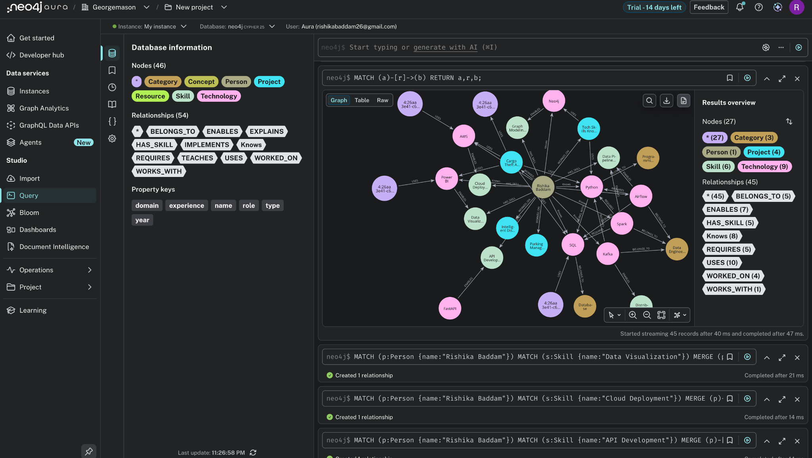
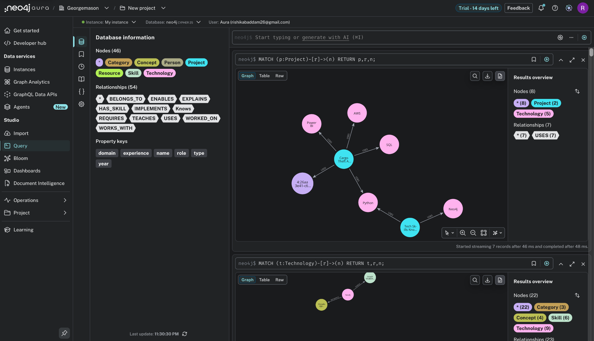
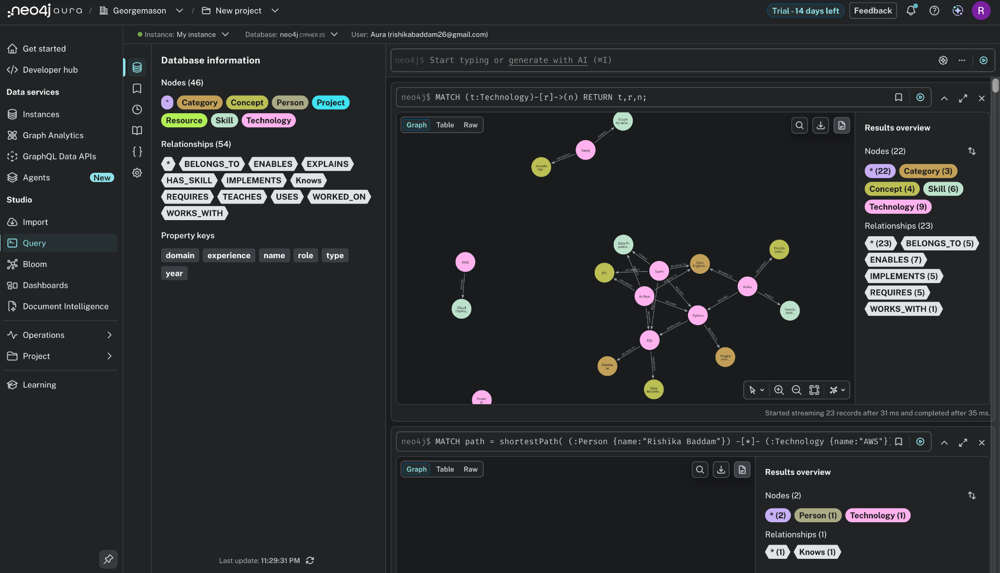

# Tech Skills Knowledge Graph

A personal project built while learning **Neo4j** and graph databases.

Instead of storing information in tables, this project models technologies, skills, projects, concepts, resources, and categories as a connected knowledge graph. The goal was to understand how graph databases represent relationships and how Cypher queries can be used to traverse connected data efficiently.

This project helped me learn the fundamentals of graph modeling, relationship design, and querying connected datasets.

---

## Why I Built This

As someone interested in data engineering and backend systems, I wanted to understand how graph databases differ from relational databases.

Rather than building another SQL database, I created a knowledge graph that represents:

- Technologies I know
- Skills developed through projects
- Projects built using different technologies
- Concepts implemented by technologies
- Learning resources
- Technology categories

The project demonstrates how connected data can be explored using graph traversal instead of joins.

---

## Technologies Used

- Neo4j AuraDB
- Cypher
- Python
- Neo4j Python Driver

---

## Graph Model

### Node Types

- Person
- Technology
- Skill
- Project
- Category
- Concept
- Resource

### Relationship Types

| Relationship | Meaning |
|-------------|---------|
| KNOWS | Person knows a technology |
| HAS_SKILL | Person has a skill |
| WORKED_ON | Person worked on a project |
| USES | Project uses a technology |
| BELONGS_TO | Technology belongs to a category |
| REQUIRES | One technology depends on another |
| IMPLEMENTS | Technology implements a concept |
| ENABLES | Technology enables a skill |
| TEACHES | Resource teaches a technology |
| EXPLAINS | Resource explains a concept |
| WORKS_WITH | Technologies commonly work together |

---

# Project Structure

```
tech-skills-knowledge-graph
│
├── cypher
│   ├── create_graph.cypher
│   └── queries.cypher
│
├── src
│   └── app.py
│
├── screenshots
│
├── requirements.txt
├── README.md
├── .env.example
└── .gitignore
```

---

# Screenshots

## Complete Knowledge Graph

This graph shows all connected entities including projects, technologies, skills, concepts, categories, resources, and the person node.



---

## Person Relationships

The person node is connected to technologies, projects, and skills through different relationship types.


---

## Project Relationships

Each project stores the technologies used during development.

Example:

- Cargo Theft Analytics
- Tech Skills Knowledge Graph
- Intelligent Disaster Response System
- Parking Management Application



---

## Technology Relationships

Technologies are connected to categories, concepts, skills, and other technologies.

Examples include:

- Python
- SQL
- Spark
- Kafka
- Airflow
- Neo4j
- AWS



---

## Shortest Path Example

Neo4j makes it easy to discover relationships between connected nodes.

Example query:

```cypher
MATCH path = shortestPath(
(:Person {name:"Rishika Baddam"})-[*]-(:Technology {name:"AWS"})
)
RETURN path;
```

Result:


---

## Sample Query

Retrieve all projects associated with the person.

```cypher
MATCH (p:Person {name:"Rishika Baddam"})
      -[:WORKED_ON]->
      (project)
RETURN project.name;
```

Output:


---

# Running the Project

Clone the repository

```bash
git clone https://github.com/Rishikabaddam20/tech-skills-knowledge-graph.git
```

Move into the project

```bash
cd tech-skills-knowledge-graph
```

Create a virtual environment

```bash
python3 -m venv venv
```

Activate it

**macOS/Linux**

```bash
source venv/bin/activate
```

Install dependencies

```bash
pip install -r requirements.txt
```

Create a `.env` file using `.env.example`

```
NEO4J_URI=your_uri
NEO4J_USERNAME=neo4j
NEO4J_PASSWORD=your_password
```

Run the application

```bash
python src/app.py
```

---

# What I Learned

Working on this project helped me understand:

- Graph data modeling
- Property graphs
- Cypher query language
- Relationship traversal
- Shortest path queries
- Graph-based recommendations
- Neo4j AuraDB
- Python integration with Neo4j

---

## Future Improvements

Some ideas I'd like to explore next:

- GraphRAG integration
- Graph Data Science algorithms
- Recommendation engine
- Interactive Streamlit dashboard
- FastAPI backend
- Visualization using Neo4j Bloom

---

## Author

**Rishika Reddy Baddam**

GitHub: https://github.com/Rishikabaddam20
